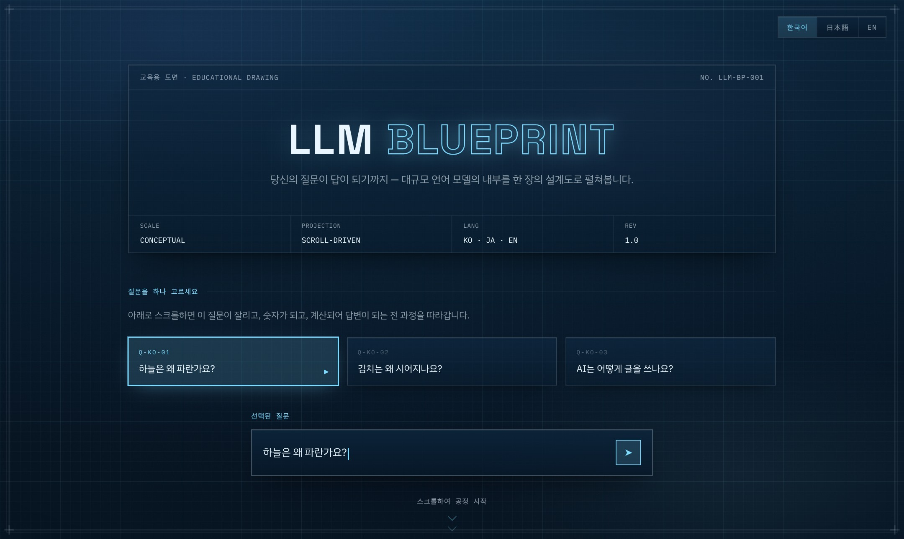
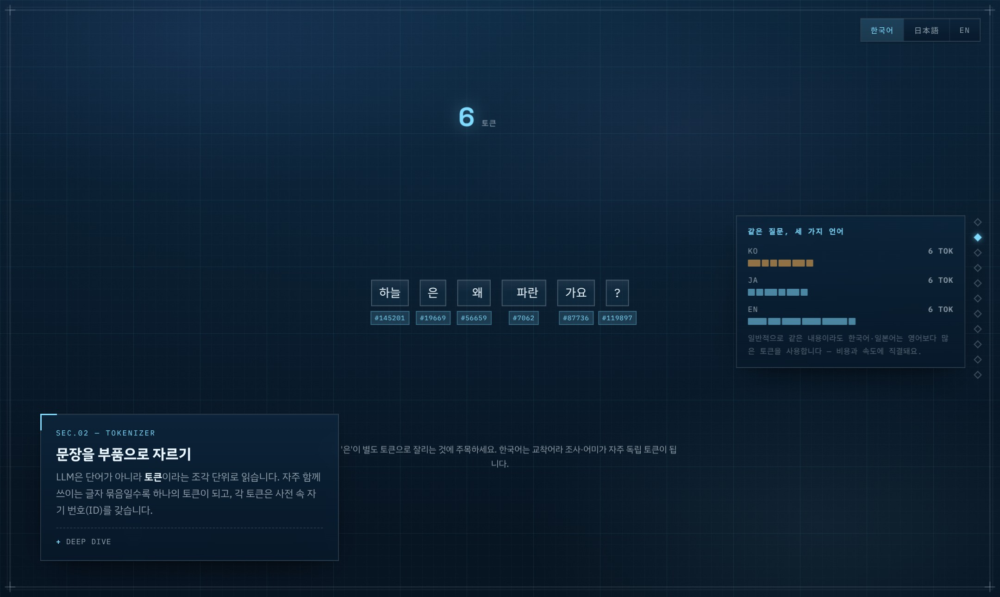
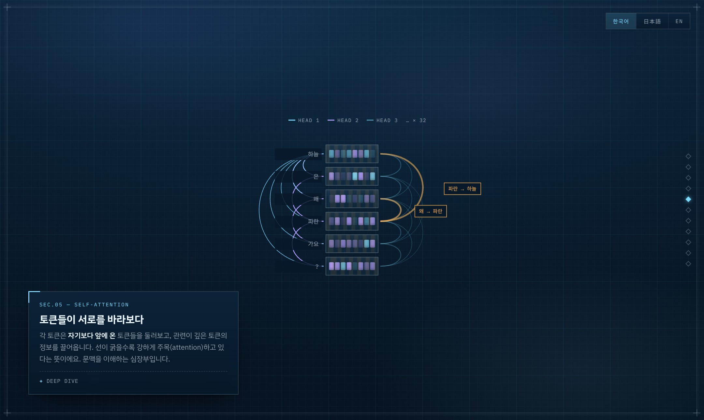
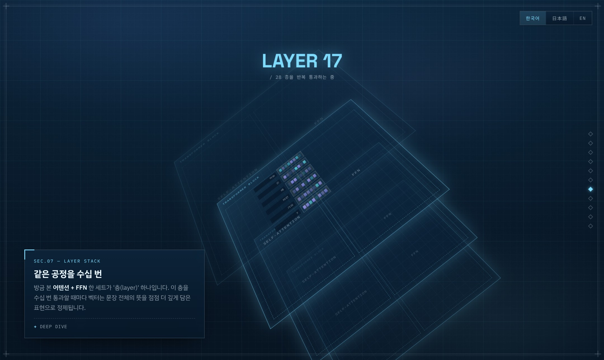
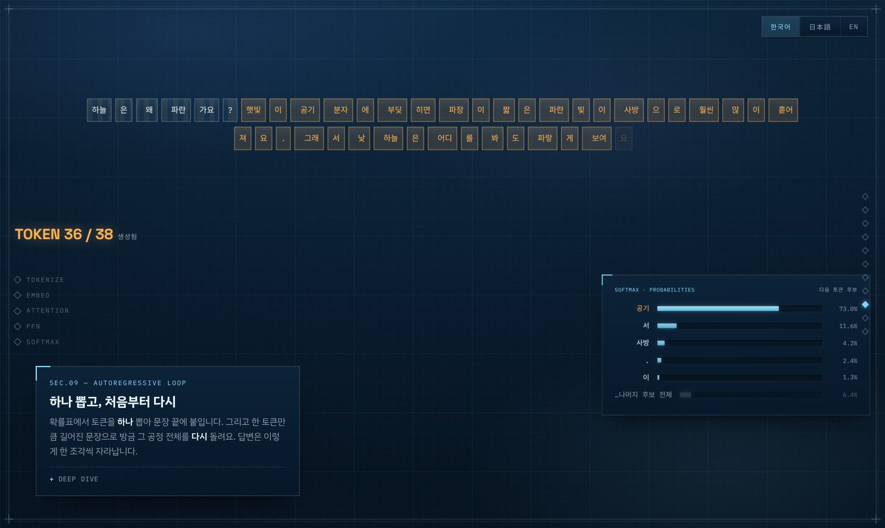

# LLM Blueprint

**[한국어](#-한국어) · [日本語](#-日本語) · [English](#-english)**

당신의 질문이 답이 되기까지 — LLM의 내부를 한 장의 설계도로.
あなたの質問が答えになるまで ― LLMの内部を一枚の設計図に。
From your question to its answer — the inside of an LLM, as a blueprint.

**Live demo → https://hangilkim11.github.io/llm_blueprint/**



| Tokenize | Self-Attention |
| --- | --- |
|  |  |
| **Layer stack (3D)** | **Autoregressive loop** |
|  |  |

---

## 🇰🇷 한국어

### 소개

질문 하나를 고르면, 스크롤을 내리는 동안 그 문장이 실제로 변해 갑니다:

`입력 → 토큰화 → 임베딩 → 위치 인코딩 → 어텐션 → FFN → 층 반복 → softmax → 샘플링 루프 → 답변`

화면 중앙의 토큰 블록은 처음부터 끝까지 **하나의 오브젝트**로 살아 있고, 스크롤에 따라
형태만 바뀝니다(잘리고, 뒤집혀 숫자가 되고, 서로를 바라보고, 층을 통과하고, 답으로 조립).
위로 스크롤하면 전 과정이 역재생됩니다.

- UI 언어 **한국어/日本語/English** 토글 (질문 프리셋도 언어별 제공)
- 공정마다 기본 설명 + **DEEP DIVE**(심화: BPE, QKV, softmax, KV cache…)
- 청사진(blueprint) 디자인 · 데스크톱/모바일 대응

### 실행

빌드 도구가 필요 없습니다.

- **그냥 열기** — `index.html` 더블클릭 (일반 `<script>` 구성이라 `file://`에서도 동작)
- **로컬 서버** — `python -m http.server` 후 `http://localhost:8000`
- **GitHub Pages** — Settings → Pages → 브랜치 선택. 그대로 배포됩니다.

폰트와 GSAP은 CDN에서 로드하므로 인터넷 연결이 필요합니다.

### 내 질문으로 보기

1. **간단** — URL에 `?custom=1`을 붙이거나 `js/config.js`의 `enableCustomInput: true`.
   인트로에 "직접 질문 입력" 카드가 생기고, 근사 토크나이저로 즉석 시각화됩니다.
2. **제대로** — `tools/generate_data.py`의 `QUESTIONS`에 질문/답변을 추가하고 실행:

   ```bash
   pip install tiktoken   # 선택 — 있으면 실제 o200k 토큰화 사용
   python tools/generate_data.py
   ```

### 구조

```
index.html            뼈대 + 페이즈 캡션 카드(3개 언어 키)
css/blueprint.css     디자인 토큰 · 청사진 시트(그리드/프레임/스탬프)
css/scenes.css        인트로/파이프라인/리캡 레이아웃
js/config.js          ★ 설정 (링크, 커스텀 입력 플래그)
js/tokenizer.js       근사 토크나이저 + 커스텀 질문 빌더
js/engine/actors.js   영속 토큰 칩 — 전 과정에서 같은 칩이 변신
js/engine/director.js 단일 pin + 마스터 타임라인 (GSAP ScrollTrigger)
js/phases/p01~p10     파이프라인 페이즈 (같은 무대 위 연속 안무)
js/scenes/            정적 씬 (인트로, 전도/푸터)
data/captions.js      전체 교육 카피 (ko/ja/en)
data/questions.data.js  프리셋 9문항 (자동 생성)
tools/generate_data.py  데이터 베이커
```

새 페이즈 추가: `js/phases/`에 모듈을 만들어 `LLMBP.phases.push({id, span, build})`,
`index.html`에 캡션 카드와 `<script>` 한 줄.

### 정직성 고지

이 시각화는 **교육용 개념 재구성**입니다. 어텐션 가중치·확률값은 실제 모델 내부 값이
아니라 그럴듯하게 생성한 예시이며, 페이지에도 같은 고지가 표시됩니다. 토큰 분할은
기본적으로 근사이고, `tiktoken`으로 재생성하면 실제 토큰화로 교체됩니다.

---

## 🇯🇵 日本語

### 紹介

質問を一つ選ぶと、スクロールする間にその文が実際に変化していきます：

`入力 → トークン化 → 埋め込み → 位置エンコーディング → アテンション → FFN → 層の反復 → softmax → サンプリングループ → 回答`

画面中央のトークンブロックは最初から最後まで**一つのオブジェクト**として生き続け、
スクロールに合わせて形だけを変えます（切られ、裏返って数値になり、互いを見つめ、
層を通過し、答えとして組み上がる）。上にスクロールすれば全工程が逆再生されます。

- UI言語 **한국어/日本語/English** トグル（質問プリセットも言語別）
- 各工程に基本解説 + **DEEP DIVE**（BPE、QKV、softmax、KV cache…）
- ブループリント（青焼き図面）デザイン · デスクトップ/モバイル対応

### 実行

ビルドツールは不要です。

- **そのまま開く** — `index.html` をダブルクリック（通常の `<script>` 構成のため `file://` でも動作）
- **ローカルサーバー** — `python -m http.server` → `http://localhost:8000`
- **GitHub Pages** — Settings → Pages → ブランチを選択するだけで公開できます。

フォントと GSAP は CDN から読み込むため、インターネット接続が必要です。

### 自分の質問で見る

1. **手軽に** — URL に `?custom=1` を付けるか、`js/config.js` の `enableCustomInput: true`。
   イントロに「質問を直接入力」カードが現れ、近似トークナイザーで即座に可視化されます。
2. **本格的に** — `tools/generate_data.py` の `QUESTIONS` に質問/回答を追加して実行：

   ```bash
   pip install tiktoken   # 任意 — あれば実際の o200k トークン化を使用
   python tools/generate_data.py
   ```

### 構造

```
index.html            骨組み + フェーズのキャプションカード（3言語キー）
css/blueprint.css     デザイントークン · 図面シート（グリッド/フレーム/スタンプ）
css/scenes.css        イントロ/パイプライン/リキャップのレイアウト
js/config.js          ★ 設定（リンク、カスタム入力フラグ）
js/tokenizer.js       近似トークナイザー + カスタム質問ビルダー
js/engine/actors.js   永続トークンチップ — 全工程を同じチップが変身
js/engine/director.js 単一 pin + マスタータイムライン（GSAP ScrollTrigger）
js/phases/p01~p10     パイプラインの各フェーズ（同じ舞台上の連続振付）
js/scenes/            静的シーン（イントロ、全体図/フッター）
data/captions.js      全教育コピー（ko/ja/en）
data/questions.data.js  プリセット9問（自動生成）
tools/generate_data.py  データベーカー
```

### 免責

本可視化は**教育目的の概念的な再構成**です。アテンション重み・確率値は実際のモデル
内部値ではなく、もっともらしく生成した例示です（ページ内にも同じ告知を表示）。
トークン分割は既定では近似で、`tiktoken` で再生成すると実際のトークン化に置き換わります。

---

## 🇬🇧 English

### About

Pick a question, then scroll: the sentence itself is transformed before your eyes —

`input → tokenize → embed → positional encoding → attention → FFN → layer stack → softmax → sampling loop → answer`

The token block at the centre of the screen is **one persistent object** from start to
finish; scrolling only morphs it (cut apart, flipped into numbers, wired together by
attention, run through the layers, assembled into the reply). Scroll up and the whole
process plays in reverse.

- UI language toggle: **한국어 / 日本語 / English** (preset questions per language)
- Every stage ships a plain-language caption + a **DEEP DIVE** (BPE, QKV, softmax, KV cache…)
- Blueprint visual language · desktop & mobile

### Run

No build tools required.

- **Just open it** — double-click `index.html` (plain `<script>` setup, works from `file://`)
- **Local server** — `python -m http.server`, then `http://localhost:8000`
- **GitHub Pages** — Settings → Pages → pick the branch. Deploys as-is.

Fonts and GSAP load from CDNs, so an internet connection is required.

### Bring your own question

1. **Quick** — append `?custom=1` to the URL, or set `enableCustomInput: true` in
   `js/config.js`. An input card appears on the intro; an approximate tokenizer
   visualizes your question instantly.
2. **Proper** — add your question/answer to `QUESTIONS` in `tools/generate_data.py`, then:

   ```bash
   pip install tiktoken   # optional — bakes real o200k tokenization
   python tools/generate_data.py
   ```

### Architecture

```
index.html            skeleton + per-phase caption cards (trilingual keys)
css/blueprint.css     design tokens · blueprint sheet (grid/frame/stamps)
css/scenes.css        intro / pipeline / recap layout
js/config.js          ★ settings (links, custom-input flag)
js/tokenizer.js       approximate tokenizer + custom question builder
js/engine/actors.js   persistent token chips — the same chips morph throughout
js/engine/director.js single pin + master timeline (GSAP ScrollTrigger)
js/phases/p01~p10     pipeline phases (continuous choreography on one stage)
js/scenes/            static scenes (intro, recap/footer)
data/captions.js      all educational copy (ko/ja/en)
data/questions.data.js  9 preset questions (auto-generated)
tools/generate_data.py  data baker
```

Add a phase: drop a module in `js/phases/` that calls
`LLMBP.phases.push({id, span, build})`, plus a caption card and one `<script>` line
in `index.html`.

### Honesty note

This visualization is a **conceptual reconstruction for teaching**. Attention weights
and probabilities are plausible fabrications, not real model internals (the page says
so, too). Token splits are approximate by default; regenerate with `tiktoken` for real
o200k tokenization.

---

Made by **Hangil Kim** · [blog](https://han-co.com/) · kim.hangil.ds@gmail.com
Built with [GSAP ScrollTrigger](https://gsap.com/), IBM Plex & Space Grotesk. MIT License.
